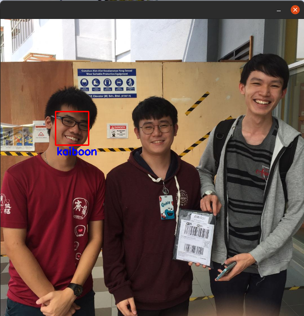

# Face-recognition-python
Sample code for face recognition using Python.

1. If you want to add face images into database, add it at the known folder.
2. For testing, you can add any face images into the unknown folder. 
3. You are free to change the folder name, but remember to edit the path in the python file.

# How to start ?
Clone this repo and run the python file on cmd/terminal/colab.

1. To run on cmd/terminal, please run python face_recognition_local_terminal.py ./known_dir ./unknown_dir
2. To run on colab, copy all the codes in face_recognition_colab.py and paste it in colab notebook
3. Run python face_recognition_realtime_webcam.py if you want to detect face on realtime.

# Some sample result

# Acknowledgement
Some of the codes are borrowed from [ageitgey](https://github.com/ageitgey/face_recognition) repo.

